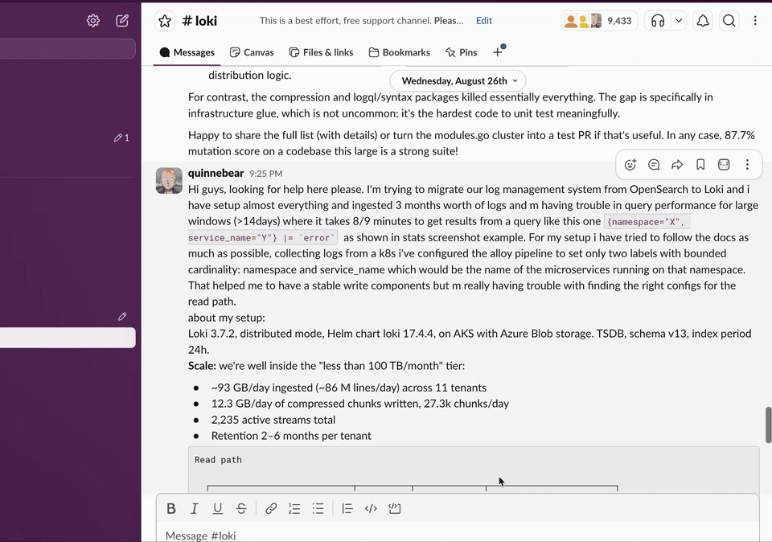
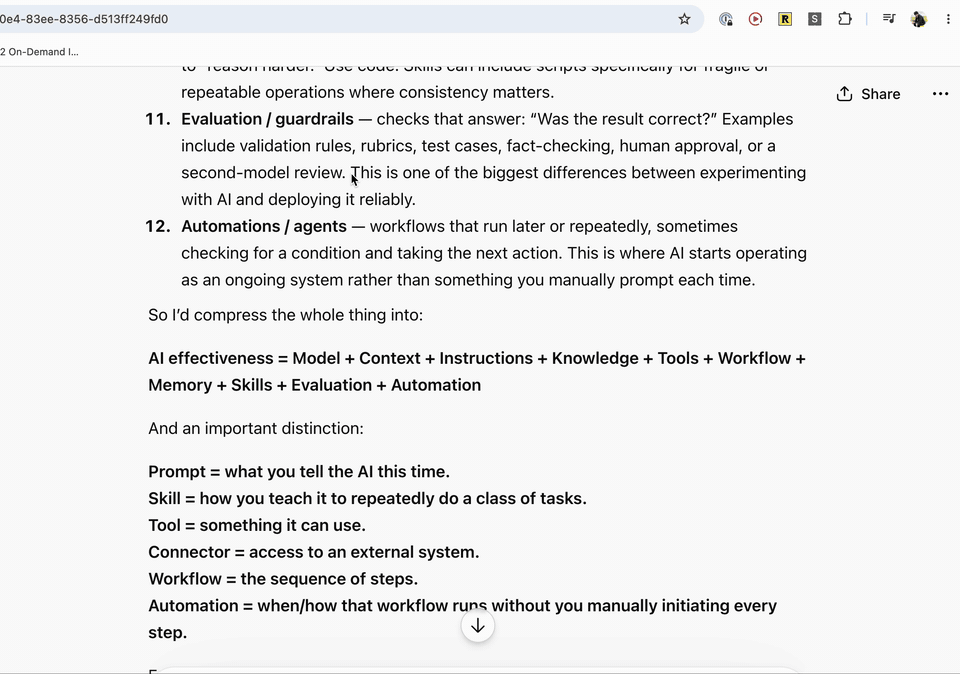

# Select Explainer

Highlight text. Ask about it. The answer stays pinned to that text instead of
being appended to the conversation you're reading.

### Raycast extension



### Chrome extension



LLM chats are linear. Thinking isn't. You ask one thing, the answer raises three
more, and every clarification you send makes the thread longer and the context
heavier. Five levels deep you've forgotten what you came to solve.

I think the fix is an interface change, not a model change. Clarifications are
side-notes. They belong on the text that raised them, the way a comment belongs
on a paragraph in a doc, and they should disappear from view once they've done
their job. That's the whole product. The longer argument is in
[Closing the Loops](https://vineeth.fyi/blog/select-explainer/).

Two pieces, one idea:

- **`src/`** — a Chrome extension. Works on any page. Answered highlights stay
  marked; click a mark to reopen its thread. Notes survive reloads until you
  delete them.
- **`raycast/`** — a Raycast extension for everything outside the browser:
  Slack, the ChatGPT/Claude desktop apps, PDFs, your editor. Same flow, same
  providers. Threads persist here too; re-highlighting the same text offers to
  continue where you left off, and the **Saved Notes** command lists every
  thread for browsing, continuing, or deleting.

## Install

Browser:

```bash
npm install && npm run build
```

Then `chrome://extensions` → Developer mode → **Load unpacked** → pick `dist/`.

Raycast:

```bash
cd raycast && npm install && npm run dev
```

Raycast imports it; stop the dev process and it stays installed. Give
"Ask About Selection" a hotkey (⌥A is good), and grant Raycast Accessibility
when macOS asks — that's what lets it read the highlighted text.

## Where answers come from

Opinion baked in: questions like "explain this" don't deserve expensive tokens.
The default is **Ollama** — free, local, private, and a 3B model handles
"give me an example" fine. Bring a Claude API key when you want better answers;
it's roughly half a cent a question on Opus 5.

```bash
brew install ollama
ollama pull llama3.2     # any chat model
```

Configure in the extension options (browser) or the "Select Explainer Settings"
command (Raycast). Settings apply from your next question.

One Ollama caveat. It 403s browser extensions by default because it doesn't
recognise their `Origin` header. The Chrome extension ships a
`declarativeNetRequest` rule that strips the header on localhost requests, so
it should just work — if your Chrome disagrees, the options page will show the
one-line `launchctl` fix.

Keys are stored locally (`chrome.storage.local` in the browser, Raycast's
LocalStorage on the Mac) and sent only to `api.anthropic.com`. Known trade-off:
Raycast's LocalStorage isn't its encrypted password store. Fine for a personal
tool; revisit before a Raycast Store submission.

## Answers stay yours

Most side-threads are throwaway. When one turns out to matter, **Attach to
chat** (browser) or **Paste Thread into Frontmost App** (Raycast) writes the
formatted Q&A into the message box — and stops. It never sends. The thread
joins your conversation because you decided it should, not as a side effect.
That's also why it types into the composer instead of calling any chat API.

## Speed

Time to first token, same highlight and question:

| Provider | Warm |
|---|---|
| Ollama, llama3.2 3B | ~0.7s |
| Claude Haiku 4.5 | ~0.8s |
| Claude Sonnet 5 | ~1.5s |
| Claude Opus 5 | ~1.6s |

Ollama evicts idle models after 5 minutes and a reload costs ~18s, which would
hit constantly with this sporadic-lookup pattern. So requests pin the model
with `keep_alive: 30m`, and opening the popover fires a warm-up while you're
still typing the question.

## Design decisions

- The popover lives in a **closed shadow root**. Host-page CSS can't touch it,
  page scripts can't reach into it.
- Highlights are painted with the **CSS Custom Highlight API** — the page's DOM
  is never mutated. No wrapper `<span>`s injected into someone else's React
  tree. The cost: a highlight isn't an element, so clicks are hit-tested
  against range rectangles.
- A note re-finds its text by exact quote plus ~40 characters of surrounding
  context, so repeated phrases anchor to the right occurrence and whitespace
  churn doesn't orphan it. Text that's genuinely gone leaves the note kept but
  unmarked.
- Model output renders through a markdown subset that escapes HTML first and
  emits six whitelisted tags. That property has its own tests.
- The Raycast side reads selections via the Accessibility API, with a
  simulated-⌘C fallback (guarded by a clipboard sentinel) for apps like Slack
  that hide their selection.
- `raycast/src/provider.ts` mirrors the service worker's provider logic but is
  Raycast-free, so plain Node can test it against real providers.

## Development

```bash
npm run watch      # rebuild dist/ on change
npm test           # offline: markdown escaping, anchoring, restore, attach, orphaned tabs, full UI flow
npm run test:live  # real calls to both providers; skips what isn't configured
```

```bash
ANTHROPIC_API_KEY=sk-… npm run test:live
```

## Sharing it

```bash
npm run package            # select-explainer.zip (browser, built)
npm run package:raycast    # select-explainer-raycast.zip (source; recipient runs npm install && npm run dev)
```

Both zips carry an `INSTALL.txt`. No credentials are ever in a zip.

`manifest.json` carries a public `key` so an unpacked install keeps the same
extension ID across moves and reinstalls — that's what keeps people's saved
notes when you send them a new zip. The matching `extension-key.pem` is private
and gitignored. Remove the `key` field before any Chrome Web Store upload; the
store issues its own identity.

For distribution beyond zips: an **unlisted** Chrome Web Store listing gets you
auto-updates with no developer-mode nag, and the Raycast Store (`ray publish`)
is the equivalent on that side.

## Status

A personal tool I use daily, shared as-is. Issues and small, focused PRs are
welcome; expect responses in days, not hours.

MIT — see [LICENSE](LICENSE).
